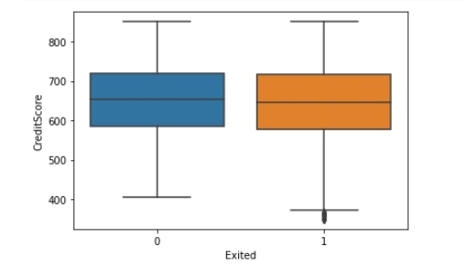
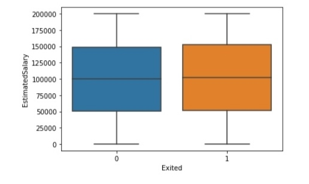

# Bank-Customer-Churn
The story: A bank is investigating a very high rate of customer leaving the bank. Here is a 10.000 records dataset to investigate and predict which of the customers are more likely to leave the bank soon.  The story of the story: I'd like to compare several techniques (better if not alone, and with the experience of several people) to improve my basic knowledge on Machine Learning.
Dataset was gotten from www.kaggle.com.

## Business Problem

The aim is to predict whether a bank's customers leave the bank or not.
The event that defines customer cancellation is the customer closing his bank account.

## Data Set Information:

It consists of 10000 observations and 12 variables.
Independent variables contain information about customers.
Dependent variable expresses customer churn status.

## Attribute Information:

Surname : Customers' surname

CreditScore : Credit score achieved

Geography : Germany, France, Spain

Gender : Female, Male

Age : Customers' age

Tenure : Numer of years

Balance : Money

NumOfProducts : Number of bank products used

HasCrCard : The state of having credit card or not

IsActiveMember : The state of active membership

EstimatedSalary : Customer's estimated salary

Exited : Churn or not

-----------------------------------------------------------------------------------------------------------------------------------------------------------------

## EDA and Preprocessing

### Null values

## Analyze Categorical columns

## Analyze Numerical columns

There is negative skewnwss in Creditscore & balance columns, will handel by applying square.

## Bivariate Analysis against the traget

## Target column

 Since the target column is  imbalanced, used <b>RandomUnderSampler</b> & <b>RandomOverSampler</b> 

## Neural Network

 Standardization using <b>StandardScaler</b> 

## RandomUnderSampler

## RandomOverSampler

 
