# Insurance Claim Status Prediction

Insurance companies take risks over customers. Risk management is a very important aspect of the insurance industry. Insurers consider every quantifiable factor to develop profiles of high and low insurance risks. Insurers collect vast amounts of information about policyholders and analyse the data.
As a Data scientist in an insurance company.

This project entails creating a model that can predict for whether a customer can claim for Insurance or not.

## Dataset Description

A file consists of data corresponding to 50552 columns which are 50552 customers and of 12 Features (Columns). Following are the features of the dataset

   - Target: Claim Status (Claim)

   - Gender : 1 - Male, 0 - Female (Gender)

   - Name of agency (Agency)

   - Type of travel insurance agencies (Agency.Type)

   - Distribution channel of travel insurance agencies (Distribution.Channel)

   - Name of the travel insurance products (Product.Name)

   - Duration of travel (Duration)

   - Destination of travel (Destination)

   - Amount of sales of travel insurance policies (Net.Sales)

   - The commission received for travel insurance agency (Commission)

   - Age of insured (Age)

   - The identification record of every observation (ID)

 
Presentation file: 

[Travel Insurance claim](Travel_Insurance_Claim.ipynb)

________________________________________________________________________________________________________________________________________________________________

## EDA and Preprocessing

### Null values in %

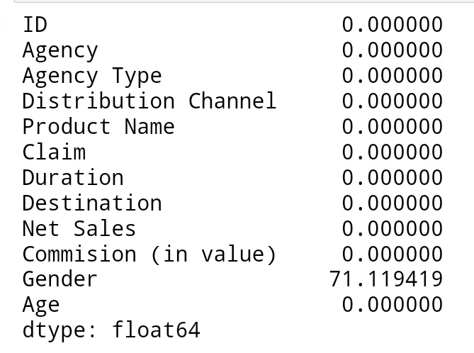

 Dropped Gender and ID column 

## Analyze Categorical columns

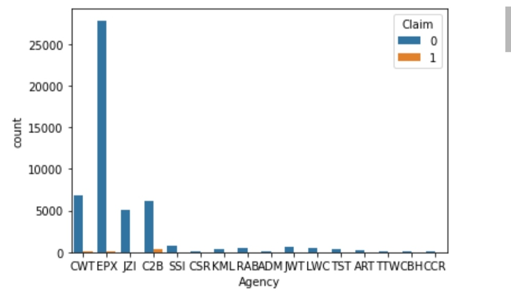
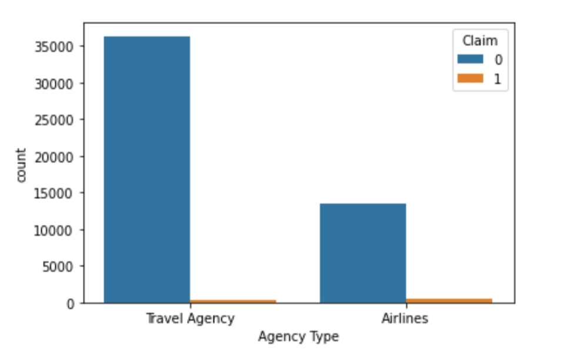
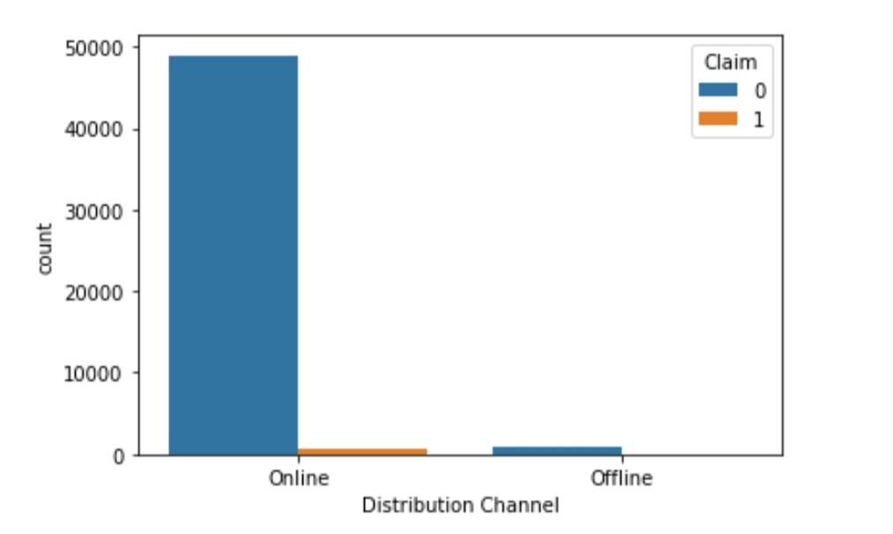
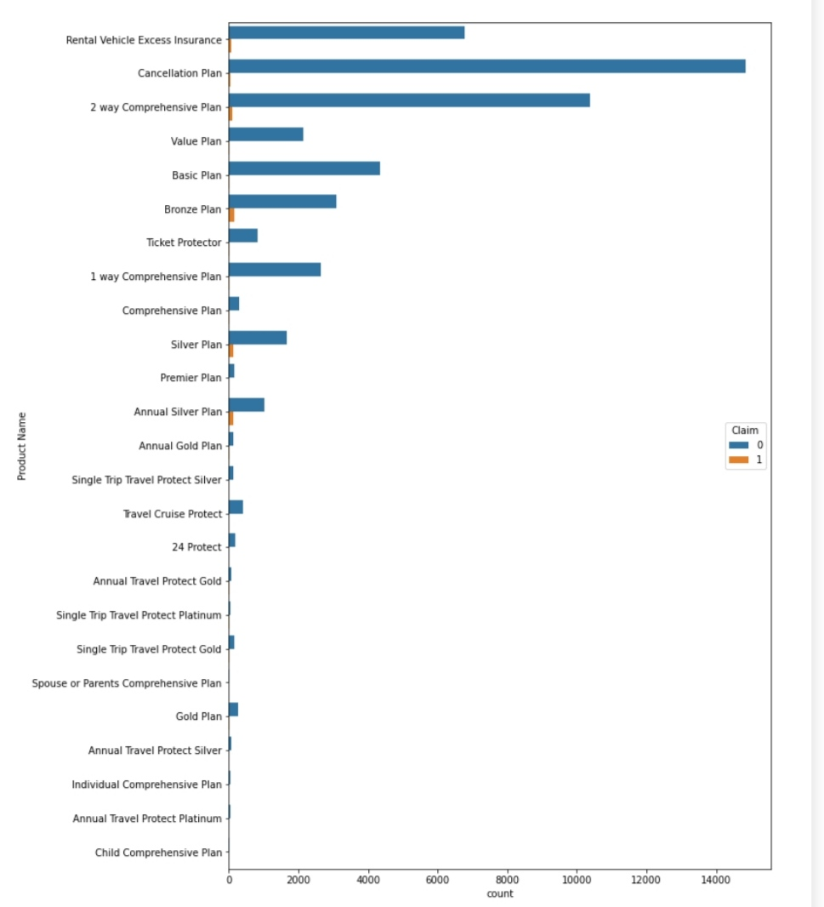
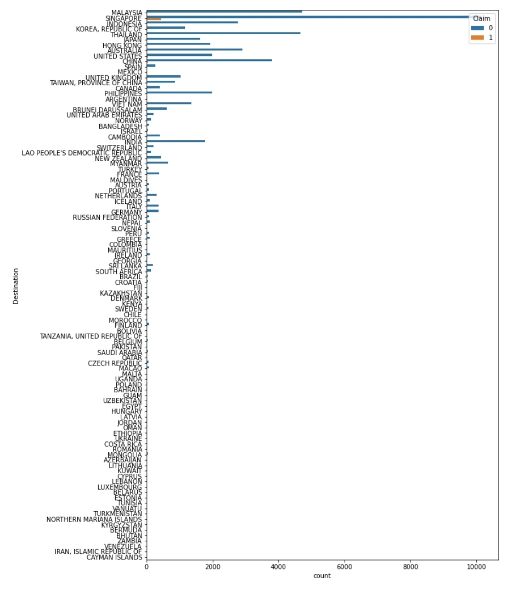

 Dropped Dristribution channel (Highly imbalanced) and Destinations (Too many classes) 

## Analyze Numerical columns

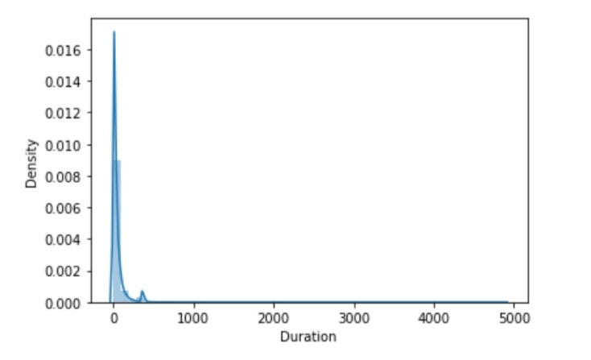
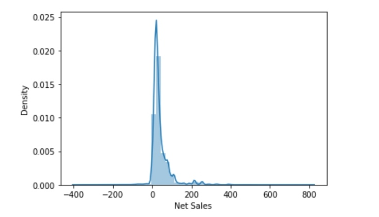
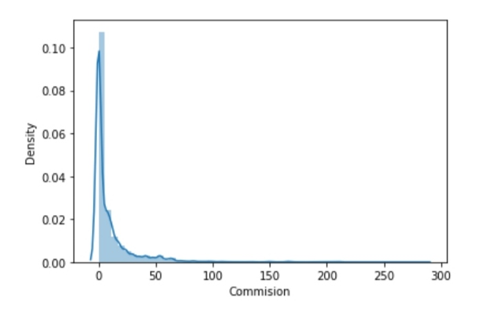
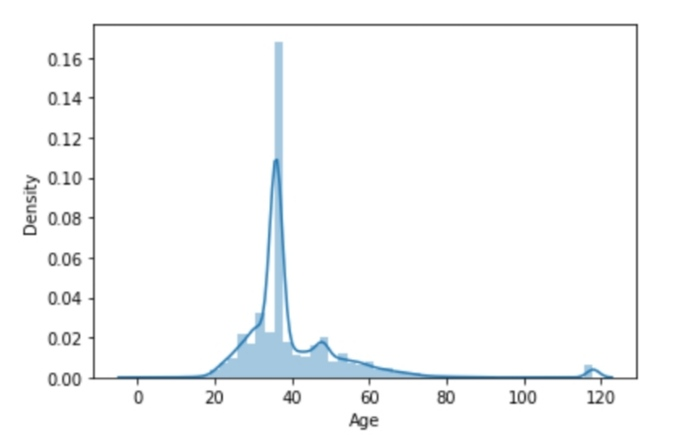

 Replaced duration values < 0 with average duration of their respective destination 
   

## Bivariate Analysis against the traget

   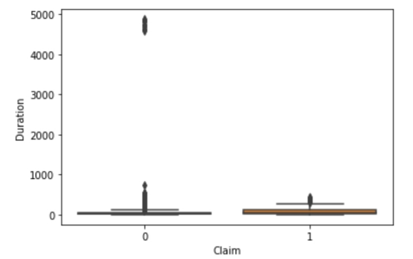
   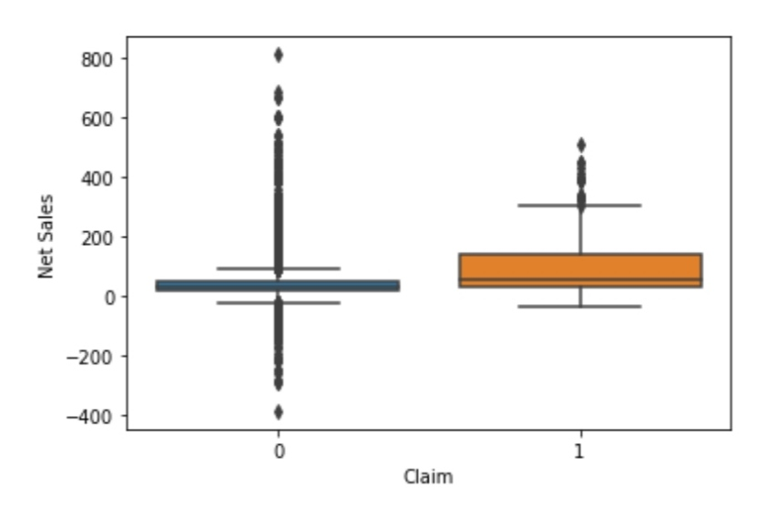
   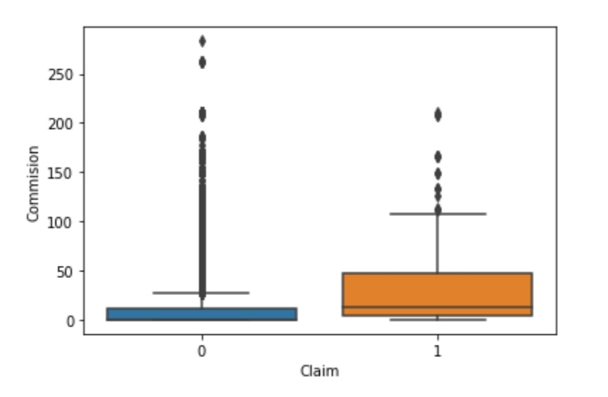
   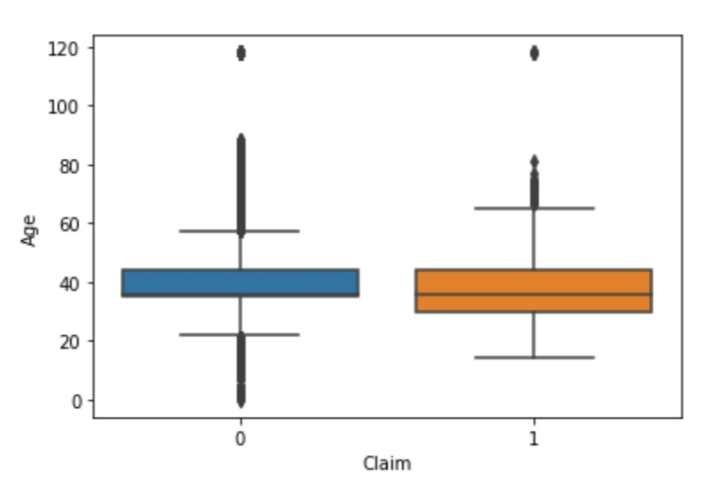
   
## Baseline model

 Decision Tree Classifier

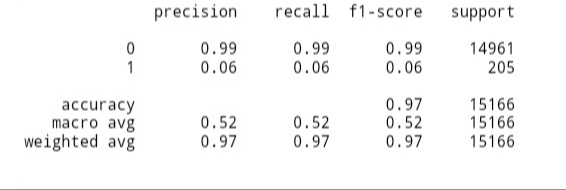

 Random Forest

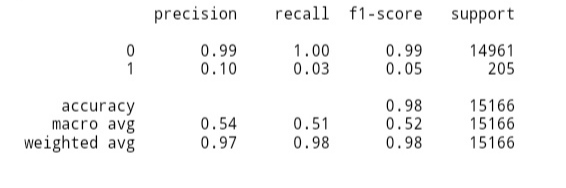

## Final Model

 Handel Skweness 

 Standardization using StandardScaler 

 Since the target is highly imbalanced, used RandomOverSampler 

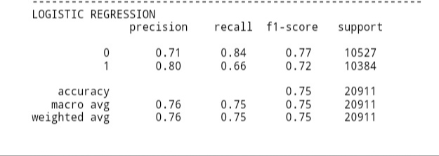
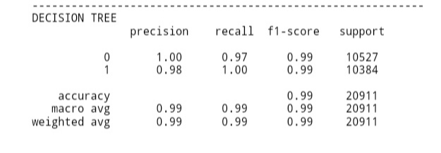
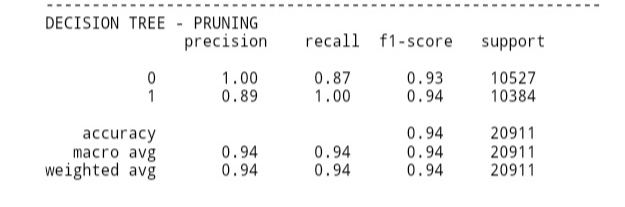
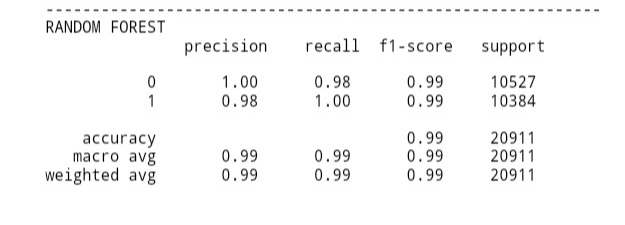
